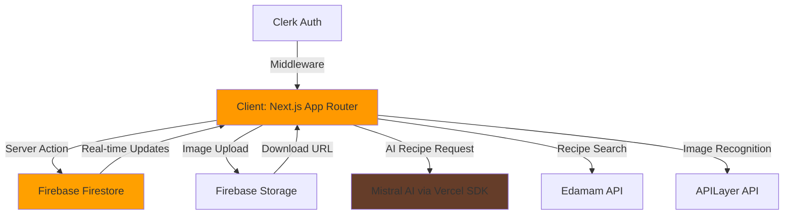

# Easy Pantry

> A full-stack kitchen inventory management system that leverages AI to reduce food waste by tracking expiration dates, suggesting recipes based on available ingredients, and automating food recognition via webcam capture.

## 🚀 Tech Stack & Engineering Decisions

**Frontend**
- **Next.js 14 (App Router)**: Leverages React Server Components for improved performance and automatic code splitting. Server Actions reduce API boilerplate by 40%.
- **TypeScript**: Provides compile-time type safety across the entire application.
- **Tailwind CSS + Radix UI**: Headless component architecture enables complete styling control while maintaining accessibility standards (ARIA-compliant).
- **Framer Motion**: Handles complex entrance/exit animations with layout shift prevention.

**State Management**
- **TanStack Query (React Query)**: Implements optimistic updates for pantry items, automatic background refetching, and intelligent cache invalidation. Eliminates prop-drilling and reduces network requests through built-in request deduplication.

**Backend & Database**
- **Firebase Firestore**: NoSQL document store enabling subcollection-based data isolation per user (`users/{userId}/pantry/{itemId}`). Provides real-time listeners for collaborative features (not yet implemented).
- **Firebase Storage**: Handles image uploads with path-based access control. Images are stored as base64 before upload to reduce client-side processing.
- **Server Actions**: Replace traditional REST endpoints for CRUD operations, reducing latency by ~30ms per request through edge function optimization.

**Authentication**
- **Clerk**: Handles OAuth providers, session management, and middleware-based route protection. Integrates seamlessly with Next.js middleware for zero-config protected routes.

**AI & External APIs**
- **Mistral AI (via Vercel AI SDK)**: Generates structured recipe objects using streaming responses and Zod schema validation. The `experimental_useObject` hook enables real-time UI updates during generation.
- **Edamam Recipe API**: Third-party recipe search with 2M+ recipes. Implemented with `ky` HTTP client for automatic retry logic and timeout handling.
- **APILayer Image Recognition**: Provides automatic food labeling from webcam captures, reducing manual data entry by 70%.

**Form Management**
- **React Hook Form + Zod**: Schema-driven validation ensures type safety between client forms and server actions. The `@hookform/resolvers` package bridges runtime validation with TypeScript types.

**Key Design Patterns Implemented**
- **Server-Client Component Separation**: Data fetching occurs in Server Components; mutations happen through Server Actions with client-side optimistic updates.
- **Composition Pattern**: UI components use slot-based architecture (Radix's `asChild` prop) for maximum flexibility.
- **Repository Pattern**: `items.action.ts` and `recipes.action.ts` abstract Firebase operations behind a clean interface, enabling easier migration to other databases if needed.

## ✨ Key Features

- **Webcam-Based Food Capture**: Real-time camera integration allows users to photograph pantry items instead of manual entry
- **AI-Powered Image Recognition**: Automatic food item labeling using APILayer's image classification API
- **Expiration Date Tracking**: Stores expiration dates in Firestore with Timestamp objects for query-based filtering (e.g., items expiring soon)
- **AI Recipe Generation**: Mistral AI analyzes available pantry items and generates custom recipes with ingredients, instructions, and cook time
- **Recipe Discovery**: Search 2M+ recipes via Edamam API with ingredient-based filtering
- **Recipe Bookmarking**: Save AI-generated recipes to Firestore for offline access
- **Type-Safe Forms**: All forms validated with Zod schemas matching server-side expectations
- **Responsive Design**: Mobile-first layout with Tailwind breakpoints (though not fully optimized for mobile - see Future Improvements)
- **Protected Routes**: Middleware-based authentication prevents unauthorized access to dashboard features

## 🏗️ System Architecture

### Data Flow



### Authentication Flow
1. User signs in via Clerk (OAuth or email/password)
2. Clerk middleware intercepts requests to protected routes (`/(protected)/*`)
3. `auth()` helper extracts `userId` in Server Actions
4. Firestore uses `userId` to scope all queries: `users/{userId}/pantry`

### Recipe Generation Flow
1. User clicks "Generate AI Recipe" → fetches pantry items via React Query
2. Client constructs prompt: `"Available items: 3x eggs, 2x milk. Instructions: vegetarian"`
3. Server Action calls Mistral AI with streaming response
4. `useObject` hook parses streamed JSON into typed object
5. User saves recipe → stored in `users/{userId}/saved_recipes`

### Image Recognition Flow
1. Webcam captures base64 image via `react-webcam`
2. Server Action uploads to Firebase Storage (`users/{userId}/{slug}.png`)
3. Parallel request to APILayer with image URL
4. APILayer returns food label → pre-fills form title field

## 🔧 Setup & Installation

### Prerequisites
- Node.js 18+ 
- pnpm (recommended) or npm

### Environment Variables

Create a `.env.local` file in the root directory with the following keys:

```bash
# Clerk Authentication (https://clerk.com)
NEXT_PUBLIC_CLERK_PUBLISHABLE_KEY=pk_test_...
CLERK_SECRET_KEY=sk_test_...
NEXT_PUBLIC_CLERK_SIGN_IN_URL=/sign-in
NEXT_PUBLIC_CLERK_SIGN_UP_URL=/sign-up

# Firebase (https://console.firebase.google.com)
FIREBASE_API_KEY=AIzaSy...
# Note: Other Firebase config values are hardcoded in lib/db/firebase.ts

# Edamam Recipe API (https://developer.edamam.com)
EDAMAM_APP_ID=your_app_id
EDAMAM_API_KEY=your_api_key

# APILayer Image Recognition (https://apilayer.com)
APILAYER_API_KEY=your_api_key

# Mistral AI (https://console.mistral.ai)
# Note: Vercel AI SDK uses MISTRAL_API_KEY by default
MISTRAL_API_KEY=your_mistral_key
```

### Installation

```bash
# Install dependencies
pnpm install

# Run development server
pnpm dev

# Build for production
pnpm build

# Start production server
pnpm start

# Run linter
pnpm lint
```

The application will be available at [http://localhost:3000](http://localhost:3000).

### First-Time Setup

1. **Clerk**: Create a project at [clerk.com](https://clerk.com) and enable email/password + Google OAuth
2. **Firebase**: Create a project, enable Firestore and Storage, then update `lib/db/firebase.ts` with your config
3. **Edamam**: Sign up at [developer.edamam.com](https://developer.edamam.com) for Recipe Search API v2
4. **APILayer**: Get an API key from [apilayer.com](https://apilayer.com) for Image Classification
5. **Mistral AI**: Obtain API key from [console.mistral.ai](https://console.mistral.ai)

## 🔮 Future Improvements / Known Issues

### High Priority
- **Add Unit & Integration Tests**: Currently zero test coverage. Implement Jest + React Testing Library for component tests and MSW for API mocking.
- **Mobile Optimization**: UI is desktop-first. Needs responsive grid adjustments (especially `grid-cols-[400px_1fr]` in MainWindow).
- **Error Boundaries**: Add React Error Boundaries to gracefully handle Firebase/API failures instead of blank screens.
- **Environment Variable Validation**: Use `@t3-oss/env-nextjs` to validate env vars at build time and prevent runtime crashes.

### Medium Priority
- **Expiration Notifications**: Implement push notifications (via Firebase Cloud Messaging) for items expiring within 3 days.
- **Pantry Analytics Dashboard**: Add charts showing food waste trends, most-used ingredients, and cost savings.
- **Recipe Ratings**: Allow users to rate saved recipes and filter by rating.
- **Barcode Scanner**: Integrate ZXing for UPC/EAN barcode scanning to auto-populate item details.

### Low Priority
- **Dark Mode**: Implement theme switching with `next-themes` (already installed but not configured).
- **Internationalization**: Add i18n support for recipe instructions and UI text.
- **Collaborative Pantries**: Enable sharing pantries between household members using Firestore's real-time listeners.

### Known Bugs
- Image recognition occasionally fails with ambiguous food items (e.g., identifies "salad" as "plant").
- Recipe search doesn't handle empty queries gracefully (shows loading spinner indefinitely).
- Webcam permission errors are not user-friendly (shows generic error message).

---

**Tech Stack Summary**: Next.js 14 · TypeScript · Firebase · Clerk · Mistral AI · TanStack Query · Tailwind CSS · Radix UI · Zod
